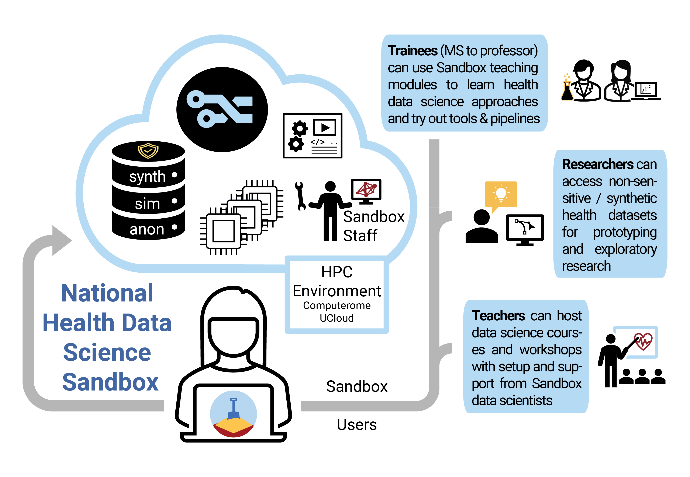

---
# Feel free to add content and custom Front Matter to this file.
# To modify the layout, see https://jekyllrb.com/docs/themes/#overriding-theme-defaults

layout: home
hide:
  - navigation
  - toc
  - footer
---

<h1 align="center" style="margin:0px">Welcome to the Health Data Science Sandbox</h1>
a collaborative project spanning across five Danish universities

<figure markdown>
  
</figure>

**Purpose:** We support health data science training and research in Denmark (and beyond)

**Methods:**  We link GDPR-safe, non-person-sensitive health datasets, teaching materials and tutorials, analysis tools, and compute power from Danish supercomputers  in a training/prototyping-ready environment which we call the Sandbox

**Features:** We package topical datasets and tutorials/teaching material as modules hosted on Github (see left menu for specific descriptions). Analysis demos are provided as R Markdowns and Python Jupyter notebooks wherever possible. See our Github org at [hds-sandbox](https://github.com/hds-sandbox) for access. These resources and required computational tools are installed and managed in Sandbox environments provided by Computerome (DTU) and UCloud (SDU) where compute resources can also be requested. 

**Usage:** We are currently supporting courses in health data science, where students are granted access to the Sandbox on request by collaborating professors. We plan to open Sandbox access to a broader user base starting with university students and researchers once more modules are developed. See our contact page if you have questions.

**Support:** We are currently providing support through a Sandbox slack channel. See our contact page for more information.

**Contribute:** The Sandbox welcomes proposals for new courses, modules, and prototyping projects from researchers. We'd like to partner with lecturers engaged with us in developing needed materials collaboratively - we would love to have input from subject experts or help promote exciting new tools and analysis methods via modules! 
Please contact us with your ideas at [nhds_sandbox@sund.ku.dk](mailto:nhds_sandbox@sund.ku.dk).

**Acknowledgements:** We thank the Novo Nordisk Foundation for funding support via the Data Science Research Infrastructure initiative. If you use the Sandbox for research or reference it in text or presentations, please acknowledge the Health Data Science Sandbox project and its funder the Novo Nordisk Foundation (grant number NNF20OC0063268). Thank you!

 

